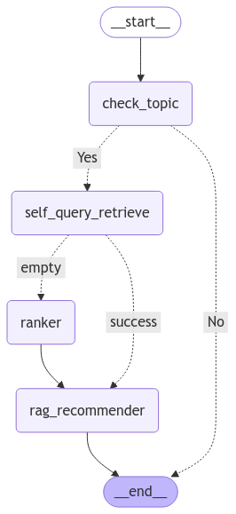
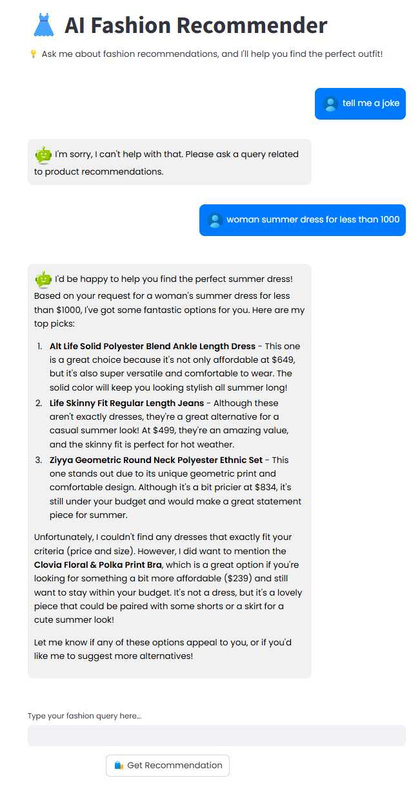

# 🛍️ LLM-Based E-Commerce Fashion Recommender

**AI-powered fashion recommendation system leveraging LLMs, embeddings, and retrieval techniques to deliver personalized shopping experiences.**


---

## 🚀 Project Overview

This project is a **Retrieval-Augmented Generation (RAG)** chatbot designed for **fashion e-commerce**. It provides **personalized recommendations, answers product queries**, and **enhances user engagement** using **state-of-the-art LLMs and vector-based retrieval**.

Built with **FastAPI, FAISS, ChromaDB, LangChain, Ollama, and Streamlit**, this system efficiently indexes a **30K-product fashion dataset** and serves real-time recommendations.

---

## ✨ Features

✅ **AI-Powered Fashion Recommendations** – Get **smart** and **personalized** product suggestions.\
✅ **Hybrid Retrieval (FAISS + BM25 + ChromaDB)** – Multi-modal search for **better results**.\
✅ **LLM-Driven Q&A** – Handles **customer queries** with **real-time responses**.\
✅ **Cross-Encoder Reranking** – Improves **retrieval accuracy**.\
✅ **Self-Querying Retriever** – Converts queries into **structured filters**.\
✅ **Streamlit Chatbot UI** – A modern, user-friendly **interface**.\
✅ **FastAPI Backend** – A **scalable API** serving the recommender.\
✅ **Dockerized Deployment** – Runs seamlessly **in containers**.

---

## 🏗️ Tech Stack

| Category                | Tools Used                              |
| ----------------------- | --------------------------------------- |
| **Programming**         | `Python 3.12`                           |
| **LLM Models**          | `GPT-4o-mini`, `Llama 3.2:3B`, `Ollama` |
| **Vector Search**       | `FAISS`, `ChromaDB`                     |
| **Retrieval & Ranking** | `BM25`, `LangChain`                     |
| **Backend**             | `FastAPI`, `Pydantic`, `Loguru`         |
| **Frontend**            | `Streamlit`                             |
| **Deployment**          | `Docker`, `Docker Compose`              |
| **Data Handling**       | `Pandas`, `Numpy`, `Kaggle API`         |
| **GPU Acceleration**    | `CUDA`, `NVIDIA Docker`, `PyTorch`      |

---

## 🔧 Setup & Installation

### 1️⃣ Prerequisites

- Python **3.12+**
- Docker & Docker Compose
- Ollama installed on your machine

### 2️⃣ Clone the Repository

```bash
git clone https://github.com/amine-akrout/llm-based-recommender.git
cd llm-based-recommender
```

### 3️⃣ Set Up Environment

Copy the example `.env` file and configure necessary credentials:

```bash
cp .env.example .env
```

Modify the `.env` file to include your **Kaggle API key**, **OpenAI API key**, and **other configurations**.

### 4️⃣ Run the Application

#### 🐳 **With Docker Compose** (Recommended)

##### CPU Version
```bash
docker-compose up --build
```
Or 
```bash
Make docker-start
```

##### 🚀 **GPU Version** (Recommended for Performance)
```bash
# Windows
run_gpu.bat

# Linux/macOS
./run_gpu.sh

# Or manually
docker-compose -f docker-compose.gpu.yml up --build
```

**GPU版本提供3-15倍的性能提升！** 查看 [GPU使用指南](docs/GPU_GUIDE.md) 了解详情。

#### 🏗️ **Manual Setup (Local Environment) using Makefile**

```bash
Make install-python # Install Python
Make install # Install dependencies
Make indexing # Index the dataset
Make retriever # Create the retriever
Make app # Start the FastAPI app
Make ui # Start the Streamlit UI
```

---

## 📡 API Endpoints

The FastAPI backend exposes multiple endpoints. After running the API, visit **Swagger Docs**:

🔗 **Swagger UI**: [`http://localhost:8000/docs`](http://localhost:8000/docs)\
🔗 **Redoc**: [`http://localhost:8000/redoc`](http://localhost:8000/redoc)

| Method | Endpoint      | Description                         |
| ------ | ------------- | ----------------------------------- |
| `POST` | `/recommend/` | Get fashion product recommendations |
| `GET`  | `/health`     | Check API health status             |

---

## 🖥️ Streamlit Chatbot UI

🔗 **Access the UI** at: [`http://localhost:8501`](http://localhost:8501)

The chatbot interface allows users to **ask for product recommendations**, filter results, and get **AI-powered responses**.

---

## 📊 Data & Indexing

The recommender is built using a **30K-product e-commerce dataset** indexed with **FAISS, BM25, and ChromaDB**.

### Indexing Pipeline:

1. **Download Dataset** – Uses `Kaggle API`
2. **Preprocess Data** – Cleans and structures the dataset
3. **Generate Embeddings** – Vectorizes product descriptions
4. **Store in FAISS & BM25** – Hybrid retrieval for fast search

---


## 🔄 Recommendation Flow

The chatbot's recommendation process follows a structured **LangGraph workflow**:



1. **Check Topic**: Determines if the query is relevant to fashion.
2. **Self-Query Retrieve**: Extracts relevant product information.
3. **Ranker**: If retrieval returns empty, BM25 & FAISS rank results.
4. **RAG Recommender**: Uses LLM to generate the final recommendation.


---
<!-- streamlit demo -->
## 📺 Demo 




## 🛠️ Project Structure

```
📦 llm-based-recommender
├── 📂 src
│   ├── 📂 api                 # FastAPI Backend
│   ├── 📂 indexing            # FAISS, BM25, Chroma Indexing
│   ├── 📂 retriever           # Query Processing
│   ├── 📂 recommender         # Core LLM-based Recommender
│   ├── 📂 ui                  # Streamlit Chatbot
│   ├── config.py              # App Configuration
├── 📄 docker-compose.yml      # Docker Services
├── 📄 Dockerfile              # API Containerization
├── 📄 pyproject.toml          # Project Dependencies
├── 📄 requirements.txt        # Python Packages
├── 📄 .env.example            # Environment Variables
```

---

## 🎯 Future Improvements

🔹 **Fine-tune LLM for better recommendations**\
🔹 **Improve UI/UX with product images**\
🔹 **Add multi-language support**\
🔹 **Deploy to AWS/GCP**\
🔹 **Multi-GPU support for enterprise deployment**\
🔹 **Real-time GPU performance monitoring**

---

## 🏆 Contributing

Contributions are welcome! If you’d like to contribute:

1️⃣ Fork the repo\
2️⃣ Create a new branch\
3️⃣ Commit your changes\
4️⃣ Submit a pull request

For major changes, please open an issue first to discuss what you’d like to change.

---

## ⭐ Star This Repo!

If you find this project useful, don’t forget to **⭐ star** the repository! 🚀✨

---

### 📩 Contact

👤 **Amine**\
💼 [**LinkedIn**](https://linkedin.com/in/akroutamine)

---
